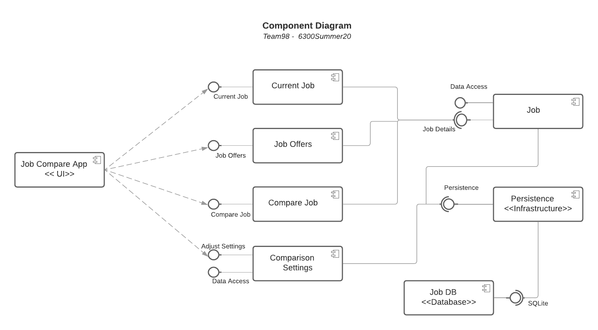
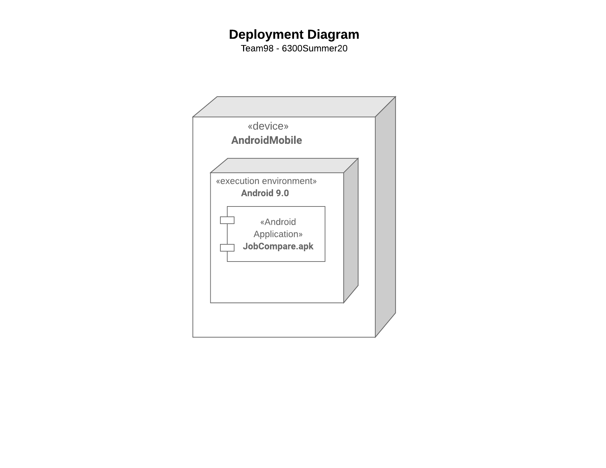
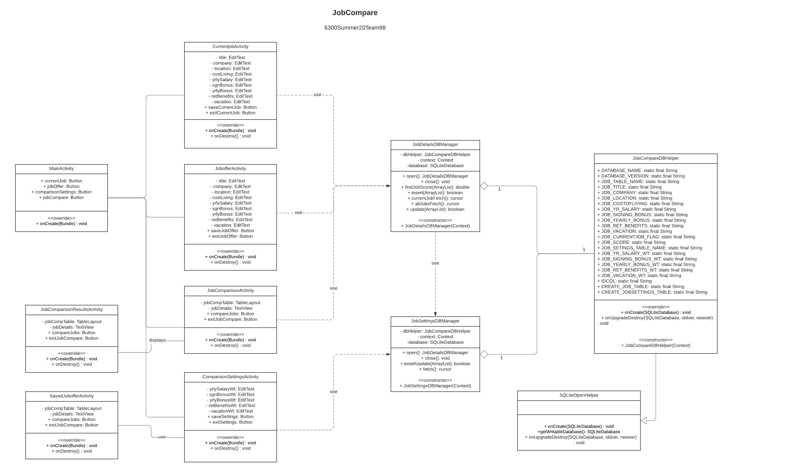
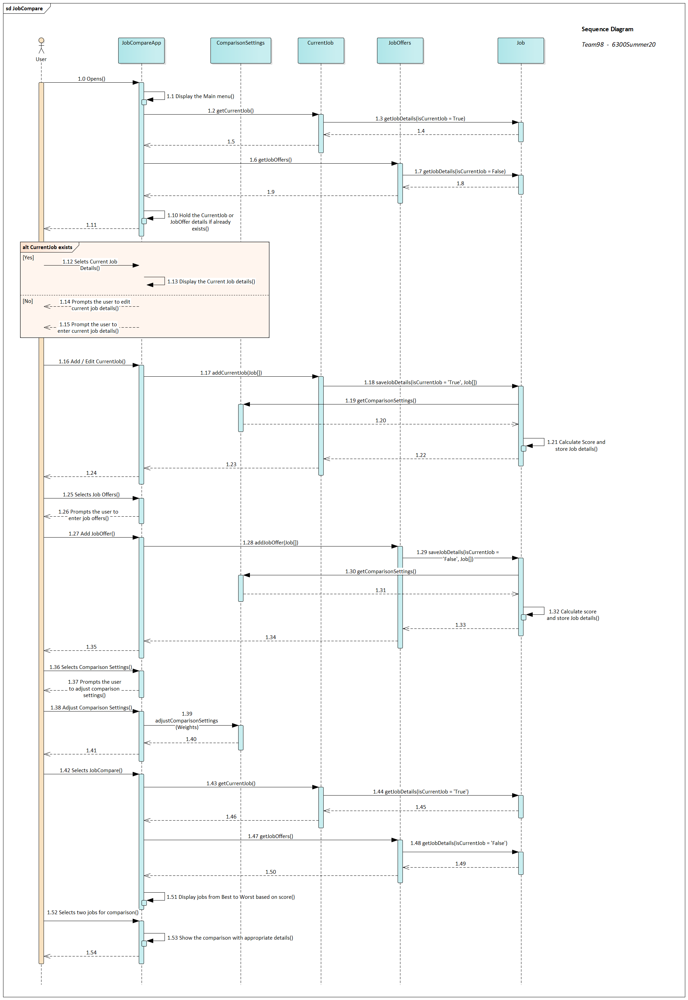
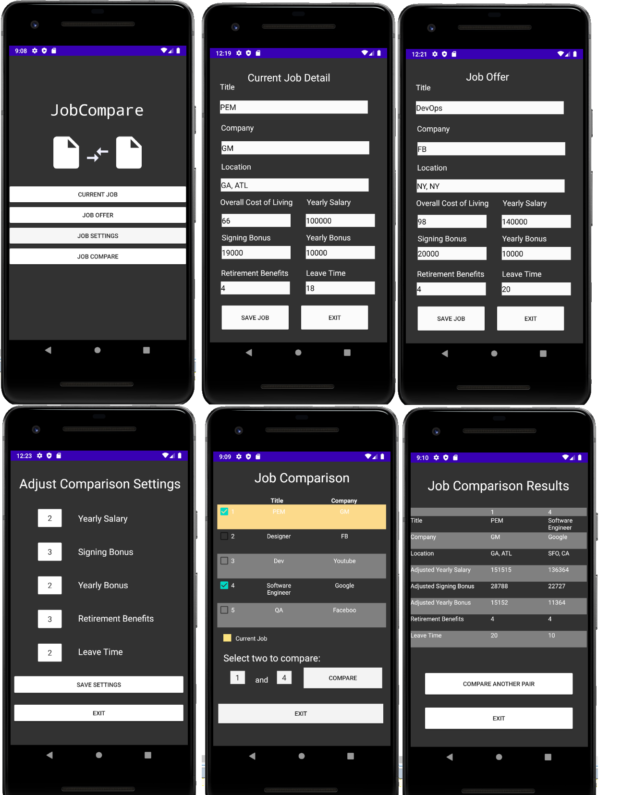

# Design Document

**Author**:  Team 98

**Log Revision:**  
Version 1 :  Initial Version of the Design document.  
Version 2 : Updated with revised Class diagram and added a new assumption.  
Version 3 **(current)** : Updated with new UI screenshots. 

## 1. Design Considerations

The below subsections provides the design considerations for the application. 

### 1.1 Assumptions

- User cannot have more than one current job.
- The app can be used only on devices that run on Android platform.  
- The app can be used by any user who has login access to the device.
- To perform a job comparison, there has to be at least two jobs entered into the system (Two Job offers or one job offer and one current job ->  Minimum requirement).
- Job comparison screen can only display a maximum of 5 job details (best to worst), allowing the user to compare two out of them.
- No live updates will be done to the App after production deployment.

### 1.2 Constraints

- App can be developed only using Android platform.
- There is no feedback or user acceptance testing for the App.
- Apps can be run only on portable devices with small screen size.
- Storage/app cache size for app development is small.

### 1.3 System Environment

- Android 9.0 (API minimum level 28)
- SQLite database for persistence.
- Devices that run on Android platform.

## 2. Architectural Design

### 2.1 Component Diagram

The Component diagram is a Structural UML diagram that provides a high level context of the application and shows the components involved and their relationships.

### 2.2 Deployment Diagram

The Deployment diagram is a Structural UML diagram that provides the deployment view of the application.

## 3 Low-Level Design

### 3.1 Class Diagram

The Class diagram is a Structural UML diagram that depicts the classes, attributes, operations and relationships between objects used in an application.

### 3.2 Other Diagrams

The Sequence diagram is a Behavioral UML diagram that shows the interactions between application components or objects in a sequence.

## 4 User Interface Design
The UI Interface Design is a graphical representation of the JobCompare Application, which the user will be seeing on their screen.

